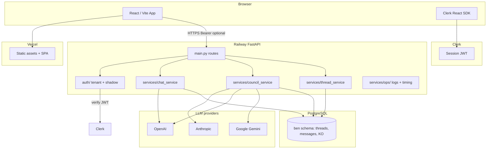
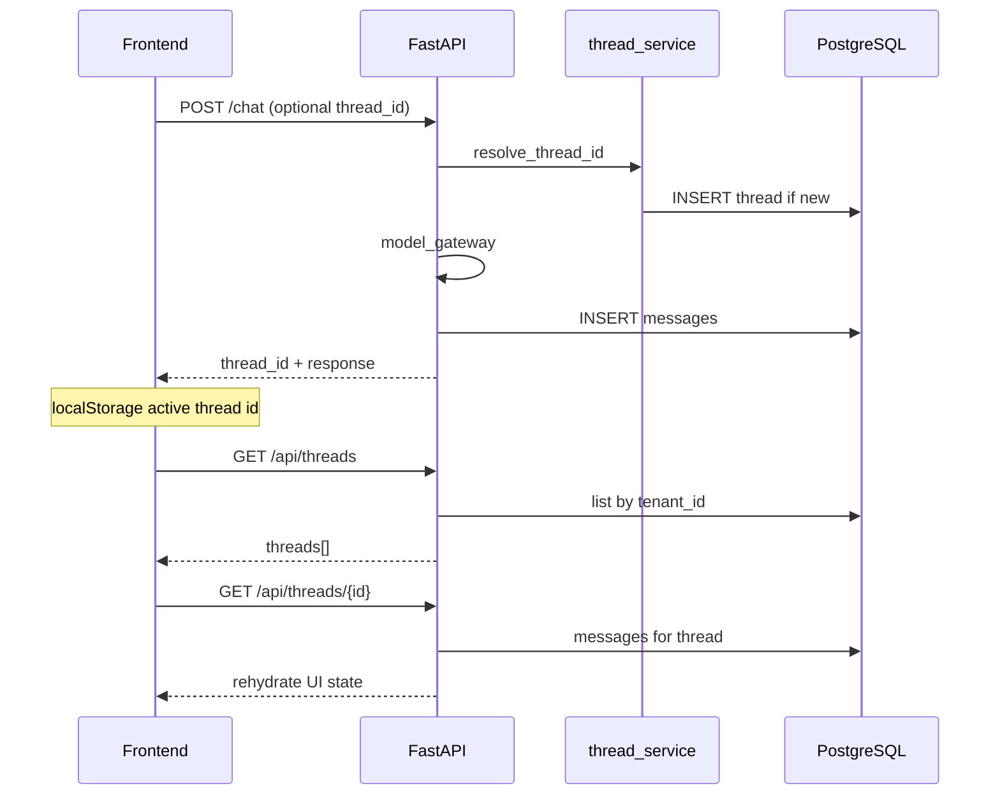
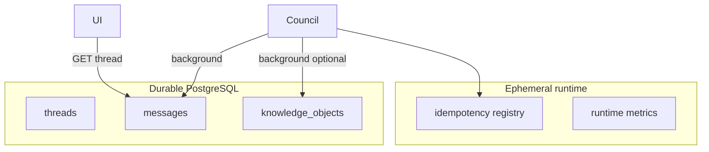
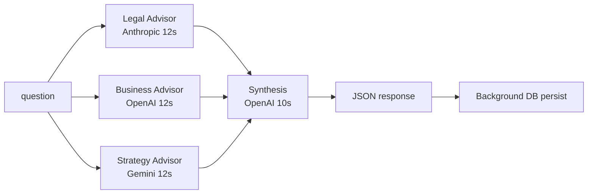

# BEN System Map v1

Architecture reference for BEN v2. Use this document to keep future work structured and scale-safe.

**Production (current):**

| Layer | Host |
|-------|------|
| Frontend | Vercel (`ben-v2.vercel.app`) |
| API | Railway (`ben-v2-production.up.railway.app`) |
| Database | PostgreSQL (Railway) |
| Auth | Clerk |

**Related docs:** `docs/RISK_REGISTER.md`, `docs/TIMING_GOVERNANCE.md`, `docs/TASK_REPORT_TENANT_MODE_V2_DEPLOY.md`

---

## 1. System overview



### Components

| Component | Role |
|-----------|------|
| **Browser / Vercel frontend** | React SPA: chat, council, thread sidebar, Clerk sign-in/org switcher. Calls API with optional `Authorization: Bearer`. |
| **Clerk** | Identity + optional organization. JWT carries `sub`, `email`, `org_id` (when org active). Publishable key in Vercel env. |
| **Railway FastAPI** | Single app (`main.py`): routes, tenant binding, provider orchestration, health. |
| **PostgreSQL** | Tenant-scoped threads/messages; RLS via `set_config('app.current_org_id', …)` per request. |
| **OpenAI** | Chat gateway, Business Advisor, council synthesis. |
| **Anthropic** | Legal Advisor (council). |
| **Google (Gemini)** | Strategy Advisor (council). |

---

## 2. Request lifecycle

Every traced route receives a **`request_id`** (middleware: accept `X-Request-ID` or generate UUID). Responses attach `request_id` where applicable.

### Common ingress pattern

```
HTTP Request
  → RequestIdMiddleware
  → CORS
  → apply_auth_policy()          # shadow log; 401 only if ENFORCE_AUTH=true
  → build_tenant_context()       # server-authoritative tenant_id
  → validate_body_tenant_matches_context()  # reject forged body tenant_id
  → log_tenant_bound()           # structured log: tenant_type, auth_source
  → route handler
```

### `POST /chat`

| Step | Module | Action |
|------|--------|--------|
| 1 | `main.py` | Parse `ChatBody` (`message`, optional `thread_id`, optional `tenant_id` ignored for binding) |
| 2 | `auth/tenant_binding.py` | Resolve `TenantContext` |
| 3 | `services/chat_service.py` | `resolve_thread_id()` → create or load thread |
| 4 | `services/model_gateway.py` | Route by `tier` → OpenAI completion |
| 5 | `chat_service` | Persist user + assistant rows in `ben.messages` |
| 6 | Response | `{ thread_id, response, model_used, cost_usd, request_id }` |

### `POST /council`

| Step | Module | Action |
|------|--------|--------|
| 1 | `main.py` | Parse `CouncilBody` (`question`, optional `thread_id`) |
| 2 | Tenant bind | Same as chat |
| 3 | `services/council_service.py` | Outer `asyncio.wait_for` **25s** (`COUNCIL_TOTAL_TIMEOUT_S`) |
| 4 | Parallel experts | Legal (Anthropic), Business (OpenAI), Strategy (Gemini) — **12s** each |
| 5 | Synthesis | OpenAI JSON synthesis — **10s** budget |
| 6 | Response | `{ question, council[], synthesis, cost_usd, request_id }` — returned before all DB writes finish |
| 7 | Background | `_schedule_background_task`: KO persist + council transcript to thread |

Frontend: **35s** client abort, progress phases, humanized errors (`frontend/src/api/council.js`).

### `GET /api/threads` and `GET /api/threads/{id}`

| Step | Action |
|------|--------|
| 1 | Tenant bind |
| 2 | `list_threads(tenant_uuid)` or `get_thread_detail(tenant_uuid, thread_id)` |
| 3 | RLS: `app.current_org_id` = effective `tenant_id` (UUID) |
| 4 | Return thread list or messages (decoded JSON envelopes for council rows) |

### `GET /health` and `GET /ready`

| Route | Purpose |
|-------|---------|
| `/health` | Liveness: DB ping, env flags, auth/tenant flags (`tenant_modes_enabled`, `require_org_for_signed_in`, `enforce_auth`). Status `healthy` or `degraded`. |
| `/ready` | Readiness: DB + required env + Alembic `migration_head`. Used for deploy gates. |

No LLM calls on health routes. **5s** route budget (`HEALTH_ROUTE_TIMEOUT_S`).

---

## 3. Tenant model

Tenant identity is **always derived server-side** from verified auth. Never from request body.

### Modes (`TenantContext`)

| `tenant_type` | When | Effective `tenant_id` (DB / RLS) | `org_id` |
|---------------|------|----------------------------------|----------|
| **anonymous** | No valid JWT; `ENFORCE_AUTH=false` | `BEN_ANONYMOUS_ORG_ID` (env) | `null` |
| **personal** | Valid JWT, no `org_id`, default policy | UUID v5 of `user:{sub}` | `null` |
| **organization** | Valid JWT with Clerk `org_id` | Clerk org UUID | same as `tenant_id` |

Logical personal id: `user:{sub}`. Storage uses deterministic UUID (`auth/tenant_ids.py`).

### Policy flags

| Env | Default | Effect |
|-----|---------|--------|
| `REQUIRE_ORG_FOR_SIGNED_IN` | `false` | If `true`, signed-in user without org → **403** `clerk_org_required` |
| `TENANT_MODES_ENABLED` | `true` | Exposed on `/health` (informational) |
| `ENFORCE_AUTH` | `false` | If `true`, invalid/missing JWT → **401** on `/chat` and `/council` |
| `AUTH_SHADOW_MODE` | `true` | Log auth outcomes without blocking |

### Client `tenant_id` rule

- Optional body field `tenant_id` on `ChatBody` / `CouncilBody`.
- **Unsigned:** ignored; server uses anonymous scope.
- **Signed:** if present, must match `ctx.tenant_id` exactly → else **422**.
- **Never** use body `tenant_id` as the source of truth.

### Org-required recovery

When `REQUIRE_ORG_FOR_SIGNED_IN=true`, missing org returns structured **403** (`auth/org_errors.py`). Frontend shows `OrgRecoveryBanner` + Clerk `OrganizationSwitcher` — not used under default personal policy.

---

## 4. Conversation lifecycle



### Thread creation

- **Draft threads:** client-only id prefix until first successful `POST /chat` or council persist.
- **Server thread:** created in `resolve_thread_id()` when no `thread_id` or unknown id for tenant.

### `thread_id` continuation

- Client sends `thread_id` on follow-up `POST /chat` or `POST /council`.
- Server validates thread belongs to bound `tenant_id` (404 if wrong tenant).

### Message persistence

- **Chat:** plain text + JSON assistant envelope (`services/message_format.py`).
- **Council:** expert rows + synthesis envelope with `kind`, `expert_outcome`, optional reasoning fields.

### Rehydration after refresh

1. On load: `GET /api/threads` (Bearer if signed in).
2. Restore `activeThreadId` from `localStorage`.
3. `GET /api/threads/{id}` → map messages into UI.
4. On `clerk_org_required`, keep local thread; show banner (no wipe).

### Council transcript persistence

- HTTP response returns before background persist completes.
- Background: `persist_council_transcript()` appends user question + expert bubbles + synthesis.
- Parallel: synthesis may also write `knowledge_objects` (dual store — see R-027).

### Persistence integrity (v1)

- **Ownership:** threads/messages = conversation truth; `knowledge_objects` = optional synthesis archive; cognitive_events unused at runtime.
- **Invariants:** `services/ops/persistence_integrity.py` — tenant/thread checks, council envelope validation, duplicate synthesis detection.
- **Rehydrate:** `GET /api/threads/{id}` audits rows; may include `integrity_warnings` (codes only).
- **Governance doc:** `docs/DATA_GOVERNANCE.md`.



---

## 5. Council lifecycle



### Experts

| Expert | Provider | Model (env-driven) |
|--------|----------|-------------------|
| Legal Advisor | Anthropic | `ANTHROPIC_MODEL` (e.g. claude-sonnet-4-6) |
| Business Advisor | OpenAI | `BUSINESS_MODEL` |
| Strategy Advisor | Google | `GEMINI_MODEL` (e.g. gemini-2.5-flash) |

### Synthesis

- OpenAI (`SYNTHESIS_MODEL`) produces structured JSON: recommendation, consensus, disagreement, optional domain reasoning fields.
- **`_honest_agreement_estimate`:** post-process; never claim full panel if any expert `outcome != ok`.
- Prompt rules: unavailable experts excluded from agreement counts; preserve rationale differences (R-022, R-024).

### Timeout / degraded handling

| Layer | Budget | Behavior |
|-------|--------|----------|
| Per expert | 12s | `outcome`: `ok`, `timeout`, `degraded`, `error` |
| Synthesis | 10s | May be `null`; council still 200 with partial experts |
| Total `/council` | 25s | Partial payload if outer timeout |
| Client | 35s | Abort + humanized error bubble |
| DB persist | 5s (background) | Failure logged; does not block HTTP |

### Agreement honesty

- UI shows expert status labels for non-ok outcomes.
- Synthesis bubble text reflects degraded panel when experts failed.
- `agreement_estimate` uses `{ok}/{ok} available` pattern, not `3/3` when Legal timed out.

---

## 6. Operational controls

| Control | Location | Purpose |
|---------|----------|---------|
| **request_id** | `RequestIdMiddleware`, `attach_request_id()` | Correlate logs and API responses |
| **JSON logs** | `BenOpsJsonFormatter`, `structured_log.py` | Machine-parseable ops logs |
| **Timeout budgets** | `services/ops/timeouts.py` | FAST 5s / PRO 12s / DELIBERATE 25s tiers |
| **Graceful degradation** | `council_service._safe_expert`, synthesis fallback | Partial council on provider failure |
| **Background persistence** | `_schedule_background_task` | Don’t block council HTTP on DB/KO |
| **Risk register** | `docs/RISK_REGISTER.md` | Track open issues; mark FIXED only after verification |
| **Health flags** | `/health`, `/ready` | Deploy verification, tenant mode visibility |
| **Tenant bind logs** | `operation=tenant_bind` | `tenant_type`, `auth_source`, `org_bound` (no JWT) |

---

## 7. Open risks and next layers

### Active risks (selected)

| ID | Topic | Status |
|----|-------|--------|
| **R-015** | No rate limiting on `/chat`, `/council` | OPEN |
| **R-019** | Auth shadow / `tenant_bind` prod log baseline | OPEN |
| **R-026** | Browser refresh rehydration E2E | PARTIAL |
| **R-028** | Council lifecycle UI recovery in browser | PARTIAL |
| **R-032** | Personal vs org ambiguity, billing/plan wiring | OPEN |

Also: R-013 (ENFORCE_AUTH), R-014 (signed forge prod test), R-025 (Legal timeout tail), R-027 (dual KO + thread store).

### Future layers (not implemented)

| Layer | Notes |
|-------|-------|
| **Progressive UX** | Richer loading states, offline hints, tier-aware UI |
| **Memory graph** | Long-horizon memory beyond thread rows — requires tenant-stable identity first |
| **Agents** | Autonomous multi-step workflows — after memory + rate limits |

Do not skip verification when adding layers.

---

## 8. Architecture rules

1. **Tenant identity before memory** — All persistence keys off server `tenant_id`; no cross-tenant reads.
2. **Memory before agents** — Durable threads/messages must be correct before agent orchestration.
3. **Rate limits before scale** — Add R-015-style protection before marketing scale (R-010, R-011).
4. **No client-trusted `tenant_id`** — Body field is validate-only; JWT + policy derive scope.
5. **No new layer before verification** — Pytest + prod smoke + browser matrix; update risk register honestly.
6. **Return fast, persist async** — Council responds before slow DB/KO paths complete.
7. **Degrade, don’t lie** — Agreement and synthesis must reflect unavailable experts.
8. **Feature flags over forks** — `ENFORCE_AUTH`, `REQUIRE_ORG_FOR_SIGNED_IN`, env-driven models.

---

## Key file index

| Area | Paths |
|------|-------|
| Routes | `main.py` |
| Tenant | `auth/tenant_binding.py`, `auth/tenant_policy.py`, `auth/tenant_ids.py` |
| Auth policy | `auth/shadow_auth.py`, `auth/config.py` |
| Chat | `services/chat_service.py`, `services/model_gateway.py` |
| Council | `services/council_service.py` |
| Threads | `services/thread_service.py`, `services/message_format.py` |
| Frontend | `frontend/src/App.jsx`, `frontend/src/api/*.js` |
| Ops | `services/ops/timeouts.py`, `services/ops/structured_log.py` |
| DB | `database/models.py`, `database/connection.py` |

---

*Last updated: 2026-05-16 — Tenant Mode v2 on `main` @ `40bd45e`.*
