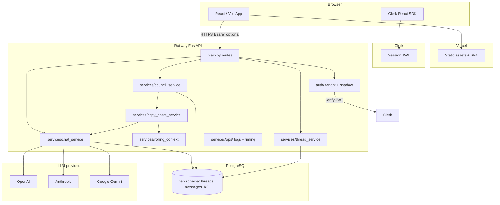
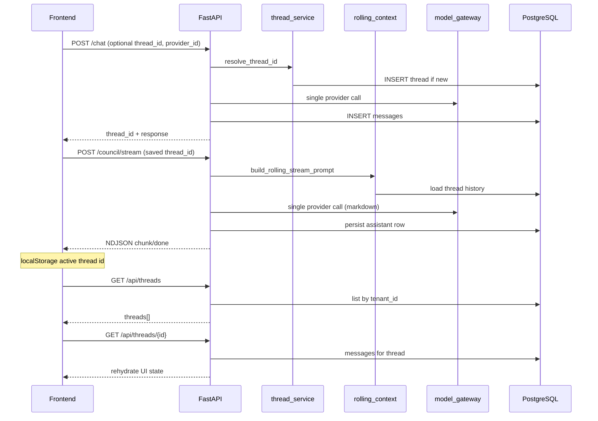
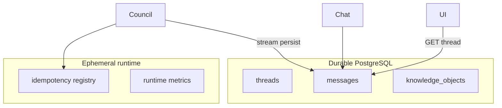
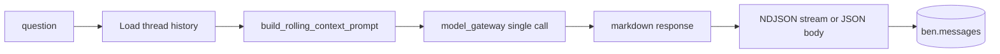

# BEN System Map v2

Architecture reference for BEN v2. Use this document to keep future work structured and scale-safe.

**Production (current):**

| Layer | Host |
|-------|------|
| Frontend | Vercel (`ben-v2.vercel.app`) |
| API | Railway (`ben-v2-production.up.railway.app`) |
| Database | PostgreSQL (Railway) |
| Auth | Clerk |

**Related docs:** `docs/RISK_REGISTER.md`, `docs/TIMING_GOVERNANCE.md`, `docs/SYSTEM_BOUNDARIES.md`, `docs/TASK_REPORT_TENANT_MODE_V2_DEPLOY.md`

---

## 1. System overview


```mermaid
flowchart TB
  subgraph client [Browser]
    UI[React / Vite App]
    ClerkUI[Clerk React SDK]
  end

  subgraph vercel [Vercel]
    Static[Static assets + SPA]
  end

  subgraph clerk [Clerk]
    JWT[Session JWT]
  end

  subgraph railway [Railway FastAPI]
    API[main.py routes]
    Auth[auth/ tenant + shadow]
    Chat[services/chat_service]
    Council[services/council_service]
    CopyPaste[services/copy_paste_service]
    Rolling[services/rolling_context]
    Threads[services/thread_service]
    Ops[services/ops/ logs + timing]
  end

  subgraph db [PostgreSQL]
    PG[(ben schema: threads, messages, KO)]
  end

  subgraph providers [LLM providers]
    OAI[OpenAI]
    ANT[Anthropic]
    GEM[Google Gemini]
  end

  UI --> Static
  ClerkUI --> JWT
  UI -->|HTTPS Bearer optional| API
  API --> Auth
  Auth -->|verify JWT| Clerk
  API --> Chat
  API --> Council
  API --> Threads
  Chat --> OAI
  Chat --> ANT
  Chat --> GEM
  Council --> CopyPaste
  CopyPaste --> Rolling
  CopyPaste --> Chat
  Chat --> PG
  Council --> PG
  Threads --> PG
```

### Components

| Component | Role |
|-----------|------|
| **Browser / Vercel frontend** | React SPA: chat, council, ad-hoc expert opinions, thread sidebar, Clerk sign-in/org switcher. Calls API with optional `Authorization: Bearer`. |
| **Clerk** | Identity + optional organization. JWT carries `sub`, `email`, `org_id` (when org active). Publishable key in Vercel env. |
| **Railway FastAPI** | Single app (`main.py`): routes, tenant binding, provider orchestration, health. |
| **PostgreSQL** | Tenant-scoped threads/messages; RLS via `set_config('app.current_org_id', …)` per request. |
| **OpenAI / Anthropic / Gemini** | Chat gateway targets (user-selected via toolbar). Council and ad-hoc opinions use the same `model_gateway` with tier-default routing unless `provider_id` is supplied (ad-hoc only). |

---

## 2. Request lifecycle

Every traced route receives a **`request_id`** (middleware: accept `X-Request-ID` or generate UUID). Responses attach `request_id` where applicable.

### Common ingress pattern

```
HTTP Request
  → RequestIdMiddleware
  → CORS
  → apply_auth_policy()          # shadow log; 401 only if ENFORCE_AUTH=true
  → build_tenant_context()       # server-authoritative tenant_id
  → validate_body_tenant_matches_context()  # reject forged body tenant_id
  → log_tenant_bound()           # structured log: tenant_type, auth_source
  → route handler
```

### `POST /chat` and `POST /chat/stream`

| Step | Module | Action |
|------|--------|--------|
| 1 | `main.py` | Parse `ChatBody` (`message`, optional `thread_id`, optional `provider_id`, optional `preferred_language`) |
| 2 | `auth/tenant_binding.py` | Resolve `TenantContext` |
| 3 | `services/chat_service.py` | `resolve_thread_id()` → create or load thread |
| 4 | `services/model_gateway.py` | Route to selected or tier-default provider |
| 5 | `chat_service` | Persist user + assistant rows in `ben.messages` |
| 6 | Response | `{ thread_id, response, model_used, cost_usd, request_id }` or NDJSON stream (`chunk` / `done`) |

### `POST /council` and `POST /council/stream`

Council is a **rolling-context opinion** — not a multi-model panel. One gateway call over the full thread transcript plus the latest question.

| Step | Module | Action |
|------|--------|--------|
| 1 | `main.py` | Parse `CouncilBody` (`question`, optional `thread_id`) |
| 2 | Tenant bind | Same as chat |
| 3 | `services/council_service.py` | Delegate to `copy_paste_service` |
| 4 | `services/rolling_context.py` | Load all prior thread turns; append opinion request |
| 5 | `services/model_gateway.py` | Single completion with `RAW_STREAM_SYSTEM` (markdown, no JSON committee format) |
| 6 | Persist | Stream path persists via `chat_service` NDJSON pipeline; non-stream via `route_request` + thread resolve |
| 7 | Response | `{ question, mode: "copy_paste", response, council: [], synthesis: null, cost_usd, thread_id, request_id }` or NDJSON stream |

Frontend: **300s** stream idle ceiling (`COUNCIL_STREAM_IDLE_TIMEOUT_MS`); humanized errors (`frontend/src/api/council.js`). No expert-phase progress UI.

### `POST /api/threads/{id}/adhoc/expert[/stream]`

Same rolling-context pipeline as council, but **`provider_id` is required** (toolbar-selected model). Persists as `adhoc_expert` envelope. Ad-hoc synthesis route **removed** (404).

### `GET /api/threads` and `GET /api/threads/{id}`

| Step | Action |
|------|--------|
| 1 | Tenant bind |
| 2 | `list_threads(tenant_uuid)` or `get_thread_detail(tenant_uuid, thread_id)` |
| 3 | RLS: `app.current_org_id` = effective `tenant_id` (UUID) |
| 4 | Return thread list or messages (decoded JSON envelopes where applicable) |

### `GET /health` and `GET /ready`

| Route | Purpose |
|-------|---------|
| `/health` | Liveness: DB ping, env flags, auth/tenant flags (`tenant_modes_enabled`, `require_org_for_signed_in`, `enforce_auth`). Status `healthy` or `degraded`. |
| `/ready` | Readiness: DB + required env + Alembic `migration_head`. Used for deploy gates. |

No LLM calls on health routes. **5s** route budget (`HEALTH_ROUTE_TIMEOUT_S`).

---

## 3. Tenant model

Tenant identity is **always derived server-side** from verified auth. Never from request body.

### Modes (`TenantContext`)

| `tenant_type` | When | Effective `tenant_id` (DB / RLS) | `org_id` |
|---------------|------|----------------------------------|----------|
| **anonymous** | No valid JWT; `ENFORCE_AUTH=false` | `BEN_ANONYMOUS_ORG_ID` (env) | `null` |
| **personal** | Valid JWT, no `org_id`, default policy | UUID v5 of `user:{sub}` | `null` |
| **organization** | Valid JWT with Clerk `org_id` | Clerk org UUID | same as `tenant_id` |

Logical personal id: `user:{sub}`. Storage uses deterministic UUID (`auth/tenant_ids.py`).

### Policy flags

| Env | Default | Effect |
|-----|---------|--------|
| `REQUIRE_ORG_FOR_SIGNED_IN` | `false` | If `true`, signed-in user without org → **403** `clerk_org_required` |
| `TENANT_MODES_ENABLED` | `true` | Exposed on `/health` (informational) |
| `ENFORCE_AUTH` | `false` | If `true`, invalid/missing JWT → **401** on protected routes |
| `AUTH_SHADOW_MODE` | `true` | Log auth outcomes without blocking |

### Client `tenant_id` rule

- Optional body field `tenant_id` on `ChatBody` / `CouncilBody`.
- **Unsigned:** ignored; server uses anonymous scope.
- **Signed:** if present, must match `ctx.tenant_id` exactly → else **422**.
- **Never** use body `tenant_id` as the source of truth.

### Org-required recovery

When `REQUIRE_ORG_FOR_SIGNED_IN=true`, missing org returns structured **403** (`auth/org_errors.py`). Frontend shows `OrgRecoveryBanner` + Clerk `OrganizationSwitcher` — not used under default personal policy.

---

## 4. Conversation lifecycle


```mermaid
sequenceDiagram
  participant UI as Frontend
  participant API as FastAPI
  participant TS as thread_service
  participant RC as rolling_context
  participant GW as model_gateway
  participant DB as PostgreSQL

  UI->>API: POST /chat (optional thread_id, provider_id)
  API->>TS: resolve_thread_id
  TS->>DB: INSERT thread if new
  API->>GW: single provider call
  API->>DB: INSERT messages
  API-->>UI: thread_id + response

  UI->>API: POST /council/stream (saved thread_id)
  API->>RC: build_rolling_stream_prompt
  RC->>DB: load thread history
  API->>GW: single provider call (markdown)
  API->>DB: persist assistant row
  API-->>UI: NDJSON chunk/done

  Note over UI: localStorage active thread id

  UI->>API: GET /api/threads
  API->>DB: list by tenant_id
  API-->>UI: threads[]

  UI->>API: GET /api/threads/{id}
  API->>DB: messages for thread
  API-->>UI: rehydrate UI state
```

### Thread creation

- **Draft threads:** client-only id prefix until first successful `POST /chat` or council/ad-hoc persist.
- **Server thread:** created in `resolve_thread_id()` when no `thread_id` or unknown id for tenant.
- **Council requirement:** council on a draft thread is rejected client-side; server thread must exist.

### `thread_id` continuation

- Client sends `thread_id` on follow-up `POST /chat`, `POST /council`, or ad-hoc expert routes.
- Server validates thread belongs to bound `tenant_id` (404 if wrong tenant).

### Message persistence

- **Chat:** plain user text + JSON assistant envelope (`kind=chat`) with `provider_id` and `model_used`.
- **Council (stream):** assistant markdown via the chat stream persist path.
- **Ad-hoc expert:** `kind=adhoc_expert` envelope with `provider_id` and session id.
- **Historical rows:** older threads may still contain legacy envelope kinds from prior releases; runtime no longer produces them.

### Rehydration after refresh

1. On load: `GET /api/threads` (Bearer if signed in).
2. Restore `activeThreadId` from `localStorage`.
3. `GET /api/threads/{id}` → map messages into UI.
4. On `clerk_org_required`, keep local thread; show banner (no wipe).

### Persistence integrity (v1)

- **Ownership:** threads/messages = conversation truth; `knowledge_objects` schema exists but is not on the council hot path.
- **Invariants:** `services/ops/persistence_integrity.py` — tenant/thread checks, envelope validation.
- **Rehydrate:** `GET /api/threads/{id}` audits rows; may include `integrity_warnings` (codes only).
- **Governance doc:** `docs/DATA_GOVERNANCE.md`.


```mermaid
flowchart TB
  subgraph durable [Durable PostgreSQL]
    T[threads]
    M[messages]
    KO[knowledge_objects]
  end
  subgraph ephemeral [Ephemeral runtime]
    IDEM[idempotency registry]
    MET[runtime metrics]
  end
  Council -->|stream persist| M
  Chat --> M
  Council --> IDEM
  UI -->|GET thread| M
```

---

## 5. Council lifecycle (copy-paste / rolling context)


```mermaid
flowchart LR
  Q[question] --> H[Load thread history]
  H --> P[build_rolling_context_prompt]
  P --> G[model_gateway single call]
  G --> R[markdown response]
  R --> S[NDJSON stream or JSON body]
  S --> DB[(ben.messages)]
```

### Pipeline modules

| Module | Responsibility |
|--------|----------------|
| `services/council_service.py` | HTTP-facing council API; returns `mode: "copy_paste"` |
| `services/copy_paste_service.py` | Bridges council/ad-hoc to chat stream or `route_request` |
| `services/rolling_context.py` | Sequential append of all prior turns + opinion request |
| `services/chat_service.py` | Stream persist and gateway dispatch (shared with chat) |
| `services/model_gateway.py` | Tier routing, circuit breaker, provider adapters |

### API response shape (non-stream)

| Field | Value |
|-------|-------|
| `mode` | `"copy_paste"` |
| `response` | Markdown string from the single model call |
| `council` | `[]` (legacy field; always empty) |
| `synthesis` | `null` (legacy field; always null) |
| `room.member_count` | `0` (legacy metadata stub) |
| `thread_id` | Resolved or created server thread |

### Timeout / failure handling

| Layer | Budget | Behavior |
|-------|--------|----------|
| Gateway (tier default) | 12s (`PRO_HARD_TIMEOUT_S`) | Provider error surfaced; no partial panel |
| Gateway (explicit `provider_id`, chat only) | 25s (`CHAT_EXPLICIT_PROVIDER_TIMEOUT_S`) | Same single-hop semantics |
| Council stream (client idle) | 300s | Abort if no bytes/events |
| Load governance | 2 concurrent council | 503 `council_busy` when saturated |

Council does **not** run per-model evaluation budgets or merge steps. One provider, one response.

---

## 6. Operational controls

| Control | Location | Purpose |
|---------|----------|---------|
| **request_id** | `RequestIdMiddleware`, `attach_request_id()` | Correlate logs and API responses |
| **JSON logs** | `BenOpsJsonFormatter`, `structured_log.py` | Machine-parseable ops logs |
| **Timeout budgets** | `services/ops/timeouts.py` | FAST 5s / PRO 12s / DELIBERATE 25s tiers |
| **Load governance** | `services/ops/load_governance.py` | Chat 8 / council 2 / total 12 inflight caps |
| **Idempotency** | `services/ops/idempotency.py` | In-process replay for chat + council |
| **Risk register** | `docs/RISK_REGISTER.md` | Track open issues; mark FIXED only after verification |
| **Health flags** | `/health`, `/ready` | Deploy verification, tenant mode visibility |
| **Tenant bind logs** | `operation=tenant_bind` | `tenant_type`, `auth_source`, `org_bound` (no JWT) |

---

## 7. Open risks and next layers

### Active risks (selected)

| ID | Topic | Status |
|----|-------|--------|
| **R-015** | Load governance browser verification | PARTIAL |
| **R-019** | Auth shadow / `tenant_bind` prod log baseline | OPEN |
| **R-026** | Browser refresh rehydration E2E | PARTIAL |
| **R-028** | Council lifecycle UI recovery in browser | PARTIAL |
| **R-032** | Personal vs org ambiguity, billing/plan wiring | OPEN |

Also: R-013 (ENFORCE_AUTH), R-014 (signed forge prod test).

### Future layers (not implemented)

| Layer | Notes |
|-------|-------|
| **Project management DB** | Task `004` — Project, Member, Task, Ledger models |
| **Progressive UX** | Richer loading states, offline hints, tier-aware UI |
| **Memory graph** | Long-horizon memory beyond thread rows |
| **Agents** | Autonomous multi-step workflows — after memory + rate limits |

Do not skip verification when adding layers.

---

## 8. Architecture rules

1. **Tenant identity before memory** — All persistence keys off server `tenant_id`; no cross-tenant reads.
2. **Memory before agents** — Durable threads/messages must be correct before agent orchestration.
3. **Rate limits before scale** — Load governance caps before marketing scale.
4. **No client-trusted `tenant_id`** — Body field is validate-only; JWT + policy derive scope.
5. **No new layer before verification** — Pytest + prod smoke + browser matrix; update risk register honestly.
6. **Single-hop opinions** — Council and ad-hoc paths are one gateway call over rolling context, not multi-model orchestration.
7. **Provider-first transparency** — Chat and ad-hoc show which model spoke; council uses tier-default routing.
8. **Feature flags over forks** — `ENFORCE_AUTH`, `REQUIRE_ORG_FOR_SIGNED_IN`, env-driven models.

---

## Key file index

| Area | Paths |
|------|-------|
| Routes | `main.py` |
| Tenant | `auth/tenant_binding.py`, `auth/tenant_policy.py`, `auth/tenant_ids.py` |
| Auth policy | `auth/shadow_auth.py`, `auth/config.py` |
| Chat | `services/chat_service.py`, `services/model_gateway.py` |
| Council | `services/council_service.py`, `services/copy_paste_service.py`, `services/rolling_context.py` |
| Ad-hoc expert | `services/adhoc_council_service.py` |
| Threads | `services/thread_service.py`, `services/message_format.py` |
| Frontend | `frontend/src/App.jsx`, `frontend/src/api/*.js` |
| Ops | `services/ops/timeouts.py`, `services/ops/load_governance.py`, `services/ops/structured_log.py` |
| DB | `database/models.py`, `database/connection.py` |
| Boundaries | `docs/SYSTEM_BOUNDARIES.md` |

---

*Last updated: 2026-06-06 — Council copy-paste / rolling context architecture; tasks 001–002 complete.*
